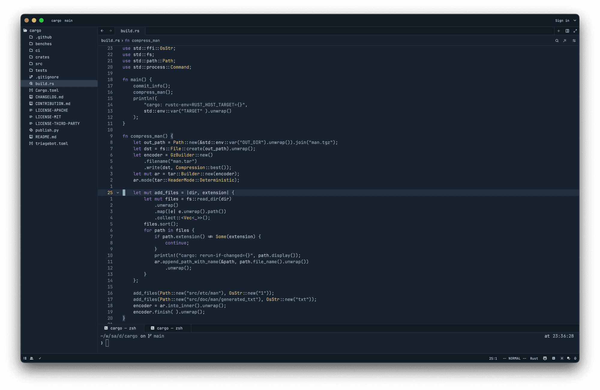
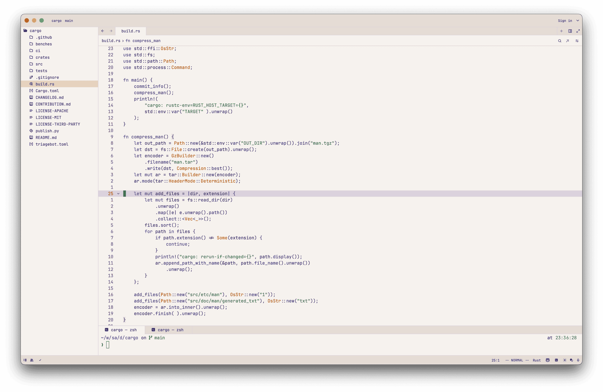
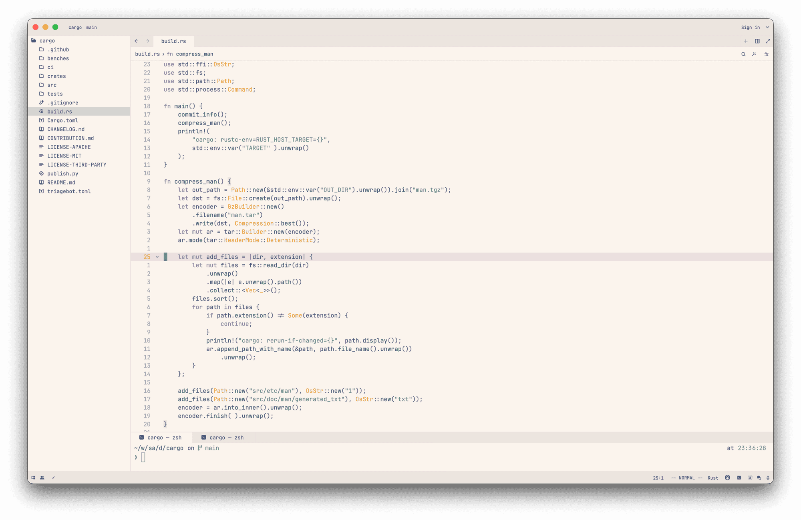
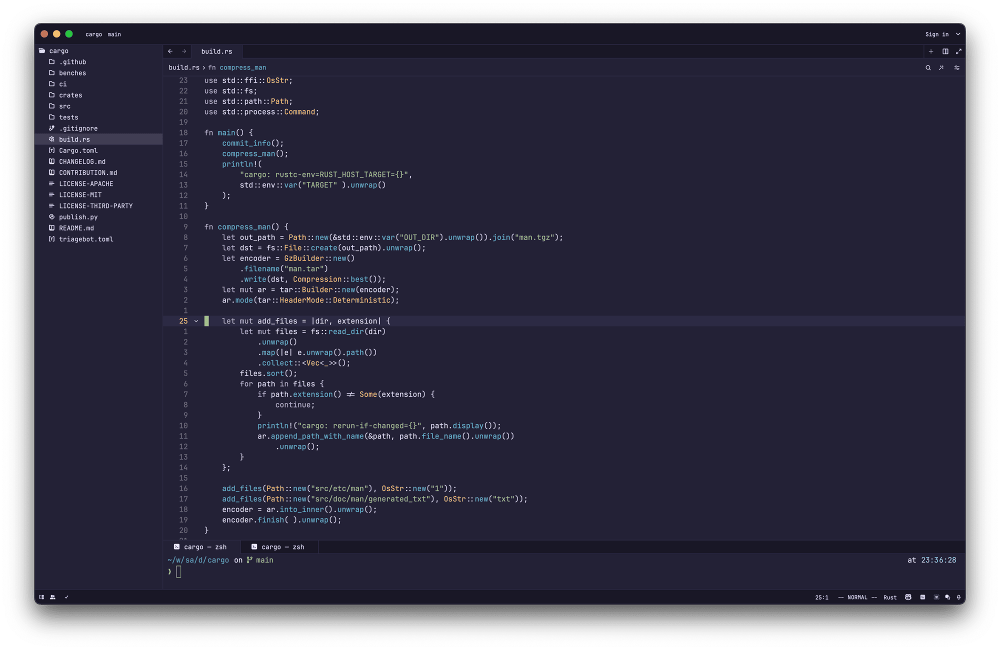
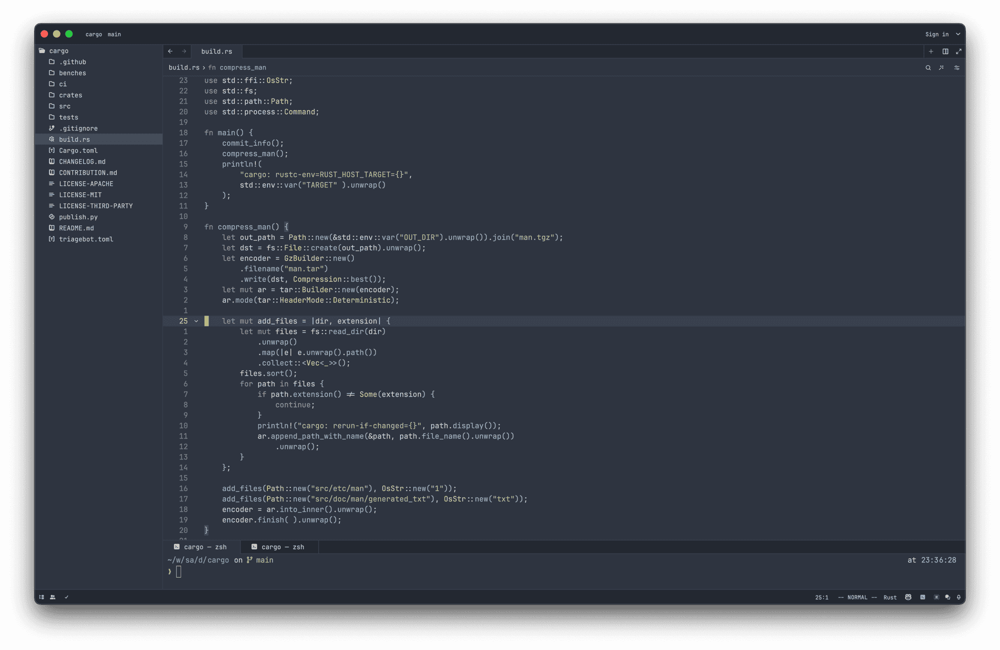
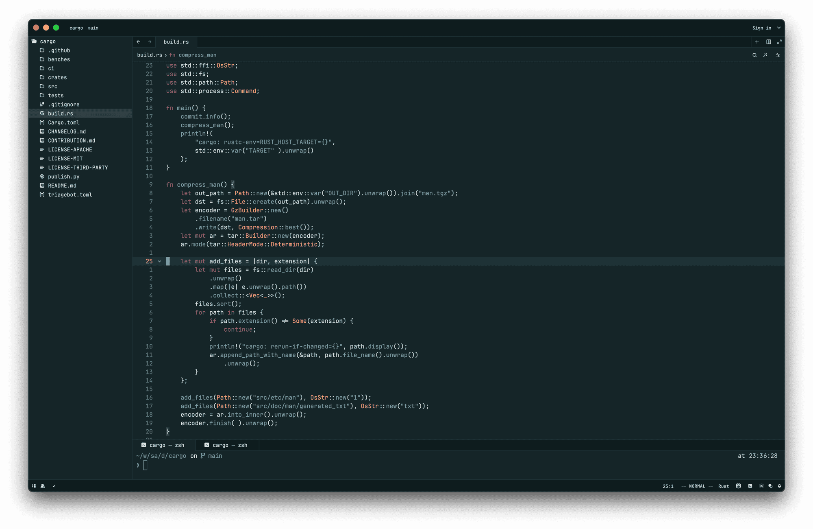
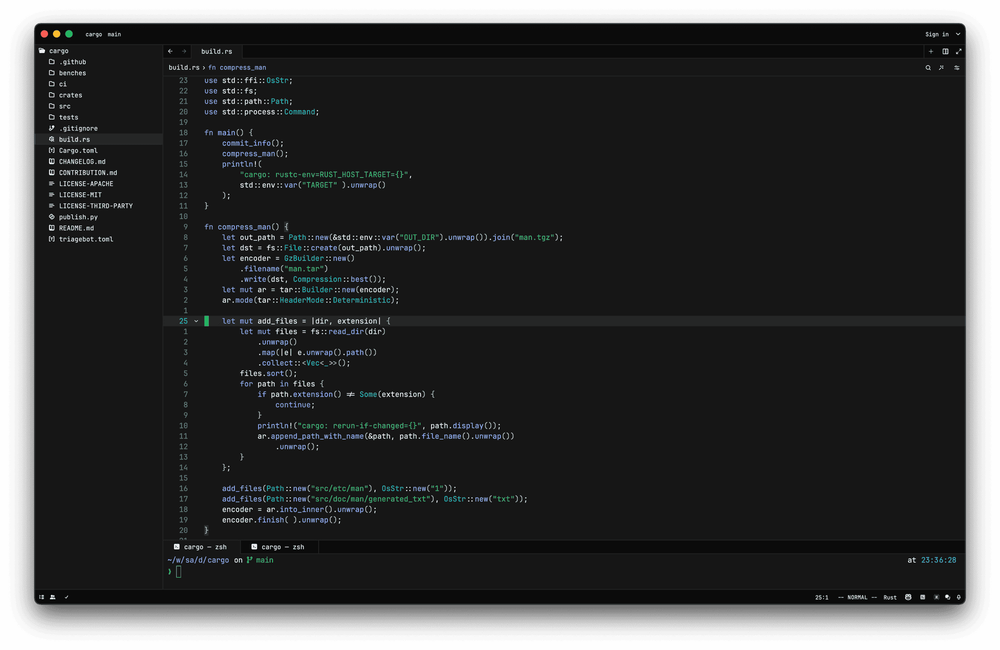

# Nightfox Zed

> A port of [nightfox.nvim](https://github.com/EdenEast/nightfox.nvim) form
> Neovim to Zed

## Available Themes

### Nightfox



### Dayfox



### Dawnfox



### Duskfox



### Nordfox



### Terafox



### Carbonfox



## Development

### Setup

Run the following command to install the required dependencies:

```sh
luarocks install nvim-nightfox
```

### Build

Run the following command to build the theme:

```sh
make build
```

or `make dev` for development mode.

It generates the appropriate zed theme config file.

## Acknowledgements

- [nightfox.nvim] original theme

[nightfox.nvim]: https://github.com/EdenEast/nightfox.nvim
